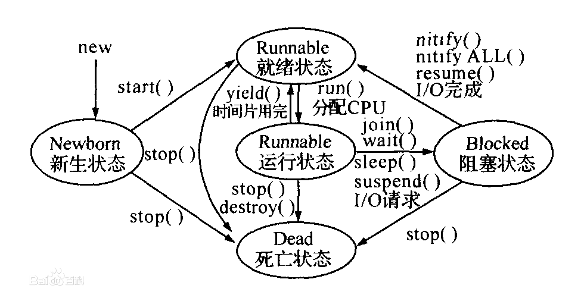

线程是进程中某个单一顺序的控制流，是程序执行流的最小单位。线程由线程ID、当前指令指针、寄存器集合和堆栈组成。线程是进程的一个实体，是被系统调度和分配的基本单位，线程与同一进程中的其他线程共享进程的全部资源。

      线程有五种基本状态：新生状态，就绪状态，运行状态，阻塞状态，死亡状态。状态间关系如下图：

 http://www.cnblogs.com/Rosanna/p/3581835.html