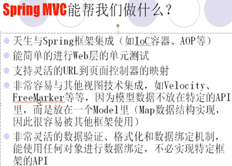
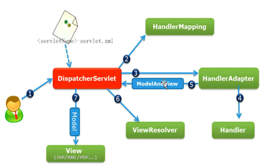
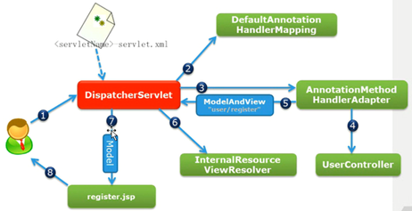

实现了MVC设计模式的，基于请求驱动类型的，轻量级Web框架

## SpringMVC框架结构

### [Spring MVC的工作原理](https://www.jianguoyun.com/p/DcMtXTgQkJSpBhj0xC0)
### [SpringMVC拦截器-性能监控](https://www.jianguoyun.com/p/DT5AfG4QkJSpBhj_xC0)
### [笔记_SpringMVC(动力节点)](https://www.jianguoyun.com/p/DcpouQ4QkJSpBhiGxS0)

springmvc简单明了的mvc框架。url传值、数组传值、对象传值、对象数组等传值类型，上传/下载文件类型需要注意。

> [超详细 Spring @RequestMapping 注解使用技巧 ](https://www.oschina.net/translate/using-the-spring-requestmapping-annotation)
> [SpringMVC架构浅析](https://www.cnblogs.com/wxisme/p/4926266.html)