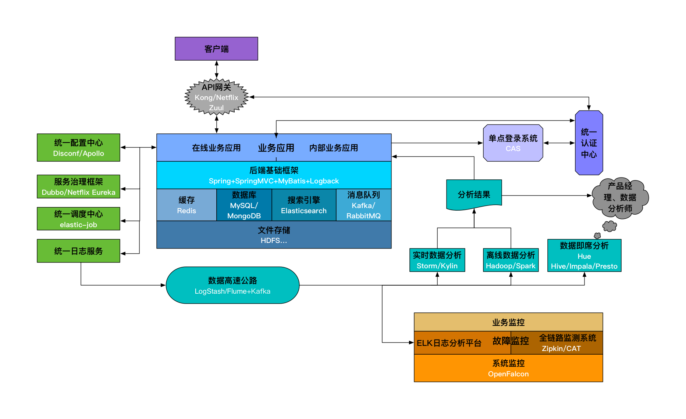
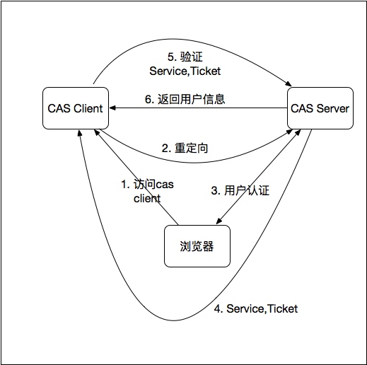
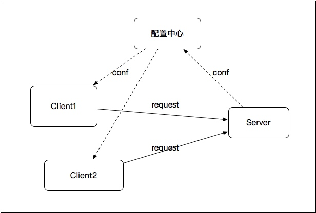
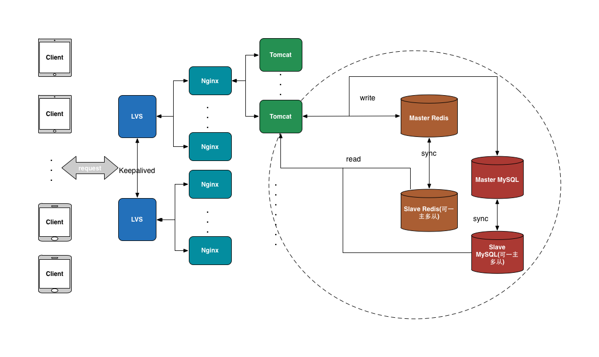
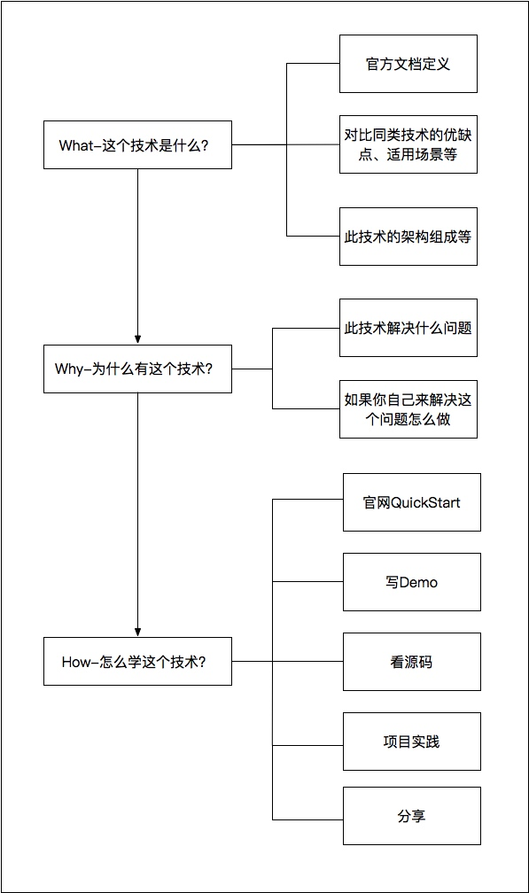

[示例代码地址](https://github.com/superhj1987/pragmatic-java-engineer)

对于后端技术而言，一般需关注以下几个指标：
*  可用率：能够正常提供服务的时间占比。是很关键的指标，需达到99.9%以上。相应时间和吞吐量
*  稳定性：即鲁棒性、健壮性，服务在异常和危险情况下保持稳定的能力
*  容错率：在服务出现错误或异常时，能够继续提供一定服务的能力，主要强调的是容许故障
*  扩展性：通过扩展（而非修改）现有系统的能力来满足需求
*  维护性：修正服务错误、功能的能力
*  安全性：保障系统及用户数据安全性的能力

## 后端基础设施

#### 统一请求入口-API网关
集成负载均衡、API访问权限控制、用户鉴权到一起作为一个服务，可以动态地修改权限控制和鉴权机制，也可以减少每个业务集成这些机制的成本。这种服务就是API网关。（开源软件实现，如Kong和Netflix Zuul）

API网关功能：权限控制、安全、负载均衡、请求转发、监控。

所有请求都要经过API网关，很容易造成系统的性能瓶颈。可以采取的方案：去掉API网关，让业务应用对接统一认证中心，在基础架构层面保证每次请求都先通过统一认证中心的认证（缓存认证结果）。

#### 后端基础框架
- MVC框架：典型的如SpringMVC、Jersey以及国人开发的JFinal以及阿里的WebX。
- IOC框架：最为流行的Spring
- ORM框架：MyBatis是目前最为流行的ORM框架。此外，Spring ORM中提供的JdbcTemplate也很不错。当然，对于分库分表、主从分离这些需求，一般就需要自己实现，开源的则有阿里的TDDL、当当的sharding-jdbc（从datasource层面解决了分库分表、读写分离的问题，对应用透明、零侵入）。此外，为了在服务层面统一解决分库分表、读写分离、主备切换、缓存、故障恢复等问题，很多公司都是有自己的数据库中间件的，比如阿里的Cobar、360的Atlas（基于MySQL-Proxy）、网易的DDB等；开源的则有MyCat（基于Cobar）和Kingshard,其中Kingshard已经有一定的线上使用规模。MySQL官方也提供了MySQL Proxy, 可以使用lua脚本自定义主从、读写分离、分区这些逻辑，但其性能较差，目前使用较少。
- 缓存框架：对Redis、Memcached这些缓存软件操作的统一封装，能够支持客户端分布式方案、主从等。一般使用Spring的RedisTemplate即可，也可以使用Jedis做自己的封装，支持客户端分布式方案、主从等。
- JavaEE应用性能检测框架：对于线上的JavaEE应用，需要有一个统一的框架集成到每一个业务中检测每一个请求、方法调用、JDBC连接、Redis连接等的耗时、状态等。Jwebap（有可能的话建议基于此项目做二次开发。）

#### 依赖的后端基础服务
* 缓存：解决热点数据的访问问题。比较普遍的缓存软件有Memcached和Redis。其中Redis已经成为最主流的
* 数据库：传统的关系型数据库（MySQL、PostgreSQL）以及最近几年开始流行的NoSQL（MongoDB、HBase）。HBase是用于大数据领域的列数据库，受限于其查询性能，一般并不用来做业务数据库。
* 搜索引擎：Solr和Elasticsearch。Elasticsearch由于对集群的良好支持以及高性能的实现，已经逐渐成为搜索引擎的主流开源方案。
* 消息队列：为日志设计的Kafka以及重事务的RabbitMQ等。ZeroMQ则是一种实现消息队列的网络编程Pattern库，位于Socket之上，MQ之下。

#### 文件存储
文件存储需要满足的特性有：可靠性、容灾性、稳定性，使发生故障也能够有回滚方案，即要保证存储的数据不会轻易丢失，即使发生故障也能够有回滚方案，也要保证高可用。在底层可以采用传统的RAID作为解决方案，再上一层，目前Hadoop的HDFS，当然还有NFS、Samba这种共享文件系统也提供了简单的分布式存储的特性。

提高文件存储的性能，最为直接和简单的做法就是抛弃传统机械硬盘，用SSD硬盘替代。

#### 统一认证中心
包括的功能：
* 用户的注册、登录验证、Token鉴权
* 内部信息系统用户的管理和登录鉴权
* APP的管理，包括APP的secret生成，APP信息的验证（如验证接口签名）等。

#### 单点登录
比较成熟的、用的最多的单点登录系统应该是耶鲁大学开源的CAS

单点登录的原理图

## 统一配置中心
具有以下特性：

* 能够在线动态修改配置文件并生效
* 配置文件可以区分环境(开发、测试、生产等)
* 在Java中可以通过注解、XML配置的方式引入相关配置

百度开源的Disconf和携程的Appllo。也可以根据自己的需求开发自己的配置中心（使用Zookeeper作为配置存储）

## 服务治理框架
对于内部服务间的调用，一般都都是通过RPC。目前主流的RPC协议：RMI、Hessian、Thrift、Dubbo。

传统的ESB（企业服务总线），ESB很容易成为性能瓶颈。因此，基于传统的ESB，更好的一种设计如下：

以配置中心为枢纽，调用关系只存在于Client和提供服务的Server之间，就避免了传统ESB的性能瓶颈问题。对于这种设计，ESB应该支持的特性如下：

* 服务提供方的注册、管理
* 服务消费者的注册、管理
* 服务的版本管理、负载均衡、流量控制、服务降级、资源隔离
* 服务的容错、熔断

Dubbo对以上做了很好的实现。Github上的dubboclub/dubbokeeper则是在其之上开发的更为强大的集管理与监控于一身的服务管理以及监控系统。此外，Netflix的Eureka也提供了服务注册发现的功能，其配合Ribbon可以实现服务的客户端软负载均衡，支持多种灵活的动态路由和负载均衡策略。

#### 统一调度中心
通常的做法就是针对各自的业务依赖Linux的Cron机制或者Java中的Quartz。Azkaban和Yahoo的Oozie是Hadoop的流式工作管理引擎。

* 根据Cron表达式调度任务
* 动态修改、停止、删除任务
* 支持任务分片执行
* 支持任务工作流：比如一个任务完成之后再执行下一个任务
* 任务支持脚本、代码、url等多种形式
* 任务执行的日志记录、故障报警

现在很多方案都是使用Zookeeper来实现Spring Quartz的分布式集群。此外，当当网开源的elastic-job则在基础的分布式调度之上又加入了弹性资源利用等更为强大的功能。

#### 统一日志服务
Log4j或者Logback

数据高速公路：
* 收集：常见的日志收集方案有：Scribe、Chukwa、Kakfa和Flume。Logstash
* 传输：消息队列。Kafka

离线数据分析：Hadoop或者Spark

实时数据分析：比较成熟的实时技术有Storm和Spark Streaming

SQL即席查询工具：Presto、Impala、Hive都是这种工具。如果想进一步提供给需求方更加直观的ui操作界面，可以搭建内部的Hue。

#### 故障监控
两个层面：

* 系统监控：主要指对主机的带宽、CPU、内存、硬盘、IO等硬件资源的监控。可以使用Nagios、Cacti等开源软件进行监控。对于分布式服务集群（如Hadoop、Storm、Kafka、Flume等集群）的监控则可以使用Ganglia。此外，小米开源的OpenFalcon也很不错，涵盖了系统监控、JVM监控、应用监控等，也支持自定义的监控机制。
* 业务监控：在主机资源层面以上的监控，比如APP的PV、UV数据异常、交易失败等。需要业务中加入相关的监控代码，比如在异常抛出的地方，加一段日志记录。

监控还有一个关键步骤是告警，告警方式：邮件、IM、短信等

方案：
* 建立ELK（Elasticsearch + Logstash + Kibana）日志集中分析平台，便于快速搜索、定位日志。搭配Yelp开源的Elastalert可以实现告警功能。
* 建立分布式请求追踪系统（也可以叫全链路监测系统），对于分布式系统尤是微服务架构，能够极大的方便在海量调用中快速定位并收集单个异常请求信息，也能快速定位一条请求链路的性能瓶颈。唯品会的Mercury、阿里的鹰眼、新浪的WatchMan、Twitter开源的Zipkin基本都是基于Google的Dapper论文而来，大众点评的实时应用监控平台CAT则在支持分布式请求追踪（代码侵入式）的基础上加入了细粒度的调用性能数据统计。此外，Apache正在孵化中的HTrace则是针对大的分布式系统诸如HDFS文件系统、HBase存储引擎而设计的分布式追踪方案。而如果你的微服务实现使用了Spring Cloud，那么Spring Cloud Sleuth则是最佳的分布式跟踪方案。还需要提到的是，Apache孵化中的SkyWalking是基于分布式追踪的一个完备的APM（应用性能监测）系统，其最大的一个特点就是基于Java agent + instrument api，对业务代码无任何侵入，Pinpoint则是类似的另一个已经用于生产环境的APM系统。

## Java后端技术概览
[Java后端工程师技能图](http://download.broadview.com.cn/Original/1804ccac3a68abd2e6dd)

#### 软件开发的核心原则
* Don't Repeat Yourself：应利用各种手段消除软件开发的重复
* Keep it simple stupid：即KISS原则。很多时候都不要想得过于复杂，也不要过度设计和过早优化，用最简单且行之有效的方案也就避免了复杂方案带来的各种额外成本
* You Ain’t Gonna Need It: 即YAGNI原则。只需要将应用程序必需的功能包含进来，而不要试图添加任何其他你认为可能需要的功能。因为在一个软件中，往往80%的请求都花费在20%的功能上。
* Done is better than perfect: 先把东西做出来，再去迭代优化
* Choose the most suitable things：在面对许多技术方案、开源实现的时候，务必做到的是不能盲目求新，要选择最合适的而非被吹得天花乱坠的。

#### 软件过程
*  项目管理：在互联网的开发工作中，敏捷开发则是比较受推崇的开发方式。所谓敏捷开发即快速实现原型，然后快速迭代。Scrum是目前普遍流行的敏捷开发方式之一。
*  测试驱动开发：在平时的开发过程中，目前比较流行也是行之有效的一种方式就是Test Driven Develop，即测试驱动开发。核心就是编写单元测试。简单来讲，就是先完成某一个功能的单元测试用例，然后在逐步消除测试用例的编译错误的过程中完成功能的开发。
*  持续集成：某一个软件功能完成开发之后，后续还有测试、预发布、部署等过程。整个过程称之为集成，而持续集成指的是无需人工干预可以不断地进行这个过程。Jenkins、Quick Build以及后起之秀Travis CI都是比较典型的持续集成工具。 此外，持续集成的子过程持续部署指的是将集成结果部署到不同的环境供用户使用，并且立即反馈部署结果，Rundeck是这方面用的比较多的软件。它提供了Web界面和命令行来执行shell命令和job工作流，能够自定义job步骤设置shell命令/job运行周期，可以在任意数量的服务器上批量执行不同的任务，降低对自动化的部署、执行、维护的工作难度。

#### 日常开发工具
* 编辑器：Emacs、Vim和SublimeText
* 源码版本管理：SVN、Git。基于Git，可以采用Git Flow做为源码管理模型。
* 项目工具：Github。
* Facebook开源的Phabrictor提供了非常强大的任务管理、Bug管理、测试、代码管理等，但其上手门槛相对较高；禅道是国人开发的一款项目管理工具，但是其免费版功能有限；以Tower.im为代表的第三方项目管理服务也是一个可选择的方案，风险在于数据都不再是私有的

#### 运行环境
* Linux：Linux: 需要熟练掌握的就是很多常用Shell命令如ps、netstat、lsof、ss、df、dh等等。此外，很多性能分析命令如top、vmstat、iostat、sar等也需要熟练使用。
* 应用服务器：就Java来讲，很多时候开发的都是Web应用，以HTTP协议对外提供服务。目前最为常用的有：Tomcat、Jetty。
* 负载均衡：LVS是最为流行的四层负载均衡软件,HAProxy是另一个即支持四层又支持七层负载均衡的软件，Nginx则是七层负载均衡最为流行的解决方案。此外，这里需要补充的是为了保证同等角色的服务的高可用，如LVS经常作为流量的入口，因此会部署多个LVS结点互为主备防止一个挂掉的时候造成服务不可用。而实现互为主备的技术目前用的最多的就是Keepalived。
* 虚拟化：微软的Virtual Server、VMware的ESX Server、SWsoft的Virtuozzo。此外，OpenStack提供的构建私有IIAS的功能、Cloud Foundry提供的构建私有平台运行环境以及Docker、Kubernetes带来的容器服务都是虚拟化技术的一种。

#### 第三方服务
* IAAS：Infrastructure As A Service
* PAAS ：Platform As A Servic。即只需要提交代码到指定的运行环境，其他的诸如代码打包、部署、IP绑定都由平台完成。除了可以使用Cloud Foundry构建自己的PAAS平台以外，现在最为流行的第三方PAAS服务有：新浪的SAE、百度的BAE以及Google的GAE
* 场景云：基于某种应用场景的云，如云客服、云即时通信、云安全服务等
* 域名：目前购买域名可以通过国外的name.com、godaddy以及国内的万网等
* CDN: 内容分发网络，即就近请求的一种技术实现。服务提供方将会被大量访问的内容在全国的多个结点都做缓存，这样当用户访问时就能够就近选择，从而减少网络传输延时，提高访问速度。七牛和又拍，阿里云、UCloud、腾讯云这种综合云服务商也都有CDN服务。
* 邮件发送：这个主要需要依赖邮件服务器，然后通过SMTP协议就可以实现发送。可以选择自己搭建，也可以选择诸如腾讯邮箱、网易邮箱等。
* 短信发送：
* 消息推送：个推
* 开放平台：通过开放平台，可以使用OAuth等协议获取用户在第三方平台上的信息实现第三方平台登录等。目前，微博、微信、QQ是最常见的第三方登录方式，基本上都是使用OAuth协议为第三方开发者提供服务的。
* 支付接口：目前，接入最多的无非是支付宝和微信，都提供了开放平台供商家接入。当然，也有直接绑定银行卡支付的，此时需要走的就是银行或者银联的网关接口。

#### 计算机基础科学知识
* 数据结构：字符串、数组、链表、哈希表、树（二叉树、平衡树、红黑树、B树）、堆栈、队列、图。
* 算法：排序和查找算法，注意递归和迭代各自的优缺点。而衡量算法性能无外乎空间复杂度和时间复杂度
* 业务相关算法：压缩算法、LRU缓存算法、缓存一致性、编译原理中的状态机等，机器学习中：用于文本分词的结巴分词和中科院ICTCLAS；用于关键词提取的TF-IDF和TextRank；用于计算文本相似度的主题模型、Word2Vec、余弦相似度以及欧几里得距离；用于文本分类的朴素贝叶斯；用于推荐的聚类、协同过滤、用户画像、隐语义模型等。
* 计算机网络： TCP/IP协议、HTTP、HTTPS、SMTP，OAuth2.0协议也在成为开放平台对外的主流协议
* 设计模式：工厂模式、简单工厂模式、单例模式、观察者模式、代理模式、建筑者模式、门面模式、适配器模式、装饰器模式等
* 操作系统
* 计算机组成原理

#### 数据处理技能
* 高速缓存：Redis，了解缓存实现的原理、内存淘汰的策略。缓存的成本较高，在使用缓存的时候一定要做好量化和存储优化工作。
* 关键点就在于对索引的使用。不同的数据库由于本身设计目的的不同，都有一些独特的优势，如：MongoDB天然支持sharding，但受限于NoSQL，在重事务、有关联关系的场景下并不适用；HBase使用LSM作为底层数据结构，牺牲了读性能来换取高速的写性能。
* 搜索引擎：掌握搜索引擎使用的数据结构、集群方式、配置的关键点
* 消息队列
* 数据存储和分析：对于离线数据分析，还有一个很关键的就是数据倾斜问题。所谓数据倾斜指的是region数据分布不均，造成有的结点负载很低，而有些却负载很高，从而影响整体的性能。因此，处理好数据倾斜问题对于离线数据处理是很关键的。
* 数据同步：从业务数据库到数据仓库的过程称为数据同步

#### JAVA编程知识
有两个大的部分，包括Java编程和JVM。

Java编程：
* IDE: Eclipse和Intellij IDEA。
* 核心语法：目前用的最多的当属JDK6的Java语法。而到了Java7引入了try with resource、switch string、diamonds等语法。Java8则又引入了lambda、stream等语法。
* 集合类：包括：HashMap、ArrayList、LinkedList、HashSet、TreeSet以及线程安全的ConcurrentHashMap、ConcurrentLinkedQueue等线程安全集合。了解他们的实现原理以及查询、修改的性能以及使用场景是非常必要的。
* 工具类：Google Guava、Apache commons、FastJson提供了很多JDK本身没有的工具类、集合等。此外，ASM字节码操作以及CGLIB代码生成能够提供更底层的java编程功能。
* 高级特性：抛开Java核心的基本编程，并发编程、泛型、网络编程、序列化RPC都属于Java的高级编程特性。其中并发编程需要掌握Executors提供的各种并发工具、Java7带来的fork/join框架以及CountDownLatch、Semaphore、CyclicBarrier等同步工具；网络编程要区分好BIO、NIO以及AIO；序列化中除了JDK自带的序列化实现之外，Protobuf和Kryo是比较高效的第三方实现；RPC的实现中，Thrift、Hessian、Dubbo以及RMI则是比较常用的几个协议,其中的Hessian是基于Http协议的，Dubbo是基于TCP协议，而Thrift则同时支持。
* JavaEE: Servlet是JavaEE中最根本的组件之一。而Servlet3.0带来的异步Servlet提高了其处理请求的性能。
* 项目构建：Maven和Gradle
* 编程框架：除了Spring核心的IOC、AOP之外，SpringMVC、Spring Data、Spring Cloud、Spring Boot等等都给Java开发者们带来了开发上的便利，大大提高了开发效率；ORM框架MyBatis也是Java领域比较火的框架之一，实现了数据库记录到Java对象的映射操作；Jersey则提供了从客户端到服务端的一整套符合RESTful规范的开发框架。此外，Vert.x、Spring Flux这种非常适用于IO密集型应用的异步响应式编程框架也开始兴起。
* 测试：黑盒测试主要指的通常进行的功能测试，白盒测试则主要指的对代码功能、质量进行的测试。此外，关键的单元测试则是开发工程师需要着重注意的地方JUnit是目前Java中实现单元测试的主流方案。

JXM相关技术：
* 虚拟机实现: Java的虚拟机实现除了我们常用的HotSpot外，还有JRockit、J9以及移动平台的Dalvkit、ART（Android4.4后引入）。我们通常所描述的JVM优化绝大多是是针对HotSpot虚拟机来说的。
* 类加载机制：JVM的类加载机器遵循双亲委派原则，即当前类加载器需要先去请求父加载器去加载当前类，如果无法完成自己才去尝试进行加载。OSGI框架则打破了此机制，采用了平等的、网状的类加载机制，以实现模块化的加载方案。
* 运行时内存组成: 程序计数器、堆栈、方法区、堆、堆外内存，这些一起组成了JVM的运行时内存。
* Java内存模型：Java的主内存+线程私有内存的模型是线程安全问题产生的根本。
* GC原理和调优：与C、C++这些语言相比，GC是Java的优势，但因为GC的细节被JVM屏蔽了，在对内存、性能要求非常苛刻的情况下难以进行自由控制，某种程度这也是劣势。如果想在某些场景下发挥GC的最大性能，能做的就是对GC的各种参数做优化配置，如新生代和老年代的垃圾回收器选择、各种垃圾回收参数的配置等。此外，很多时候由于代码质量或者外部客观因素，造成了JVM频繁GC，需要使用相关的工具快速进行问题定位和解决。
* 性能调优和监控工具：JDK自带了很多强大的调优和监控工具，包括jmap、jstack、jcmd、jconsole、jinfo等。此外，btrace是一款非常强大的在线问题动态排查工具，能够无须重启Java进程，动态的插入一些代码逻辑，拦截代码执行逻辑打印日志，从而排查问题。

#### 分布式架构
单体应用、垂直应用、分布式应用

#### 部署架构
对于Web应用来说，LVS+Nginx+Tomcat+MySQL+Redis即可构成一个简单通用的部署架构：

- LVS作为最前置的结点，负责在网络第四层转发流量、负载均衡。
- 多个LVS使用Keepalived互为主备实现高可用。
- Nginx作为反向代理，负责在网络第七层转发流量、负载均衡。此外，其做为高性能Web服务器，还可以负责静态页面/资源的访问。也可以通过Nginx lua应对一些高并发的动态场景。
- Tomcat做为业务容器，主要的应用代码都在这里面。
- Redis作为缓存，隔离高并发请求和后端数据库。
- MySQL以主从模式对数据做持久化。

其中，虚线部分是数据库层，采用的是主从模式。也可以使用Redis Cluster（Codis等）以及MySQL Cluster（Cobar等）来替换。

## 如何学习后端技术
几点建议：
* 扎实的计算机基础知识（数据结构和算法、计算机操作系统、计算机网络、计算机组成原理），进入实际的开发工作中，是否能够掌握扎实的基础知识往往决定了一个开发工程师的上限
* 知其然更要知其所以然
* 动手实践
* 频繁练习
* 持续学习
* 自我总结：总结不仅仅指的是把你平时遇到的问题记录下来，更深一层的是要找到问题发生的本质原因，如何避免发生同样的问题，从中有什么启发和收获。再进一步的则需要经常将自己一段时间内的知识收获组织成体系或者融入到自己的知识体系中，这样才能举一反三，遇到相同的问题可以有据可循。自我总结的方式包括记笔记、写博客、做分享
* 学会规划：长期规划和短期规划。对于这些短期规划，要设定的比较合理，具有可达性，也要设定好优先级，根据优先级逐步去完成。此外，规划不要定死，可以根据实际情况灵活调整。

如何学一门新技术：

看源码的典型流程：
1. 阅读该技术的架构文档，了解其总体架构和组成。
2. 根据总体架构，将源码文件以模块或者上下层级进行分类。
3. 从未阅读过的模块中选择最独立（依赖性最小）的模块代码读起。
4. 阅读此模块的功能介绍文档。
5. 阅读此模块的源代码。
6. 一边阅读一边整理调用关系（以表或者树的形式）。
7. 转到第三步。