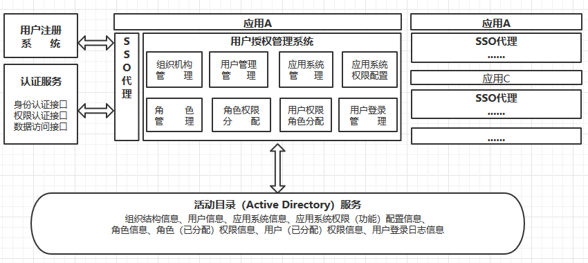
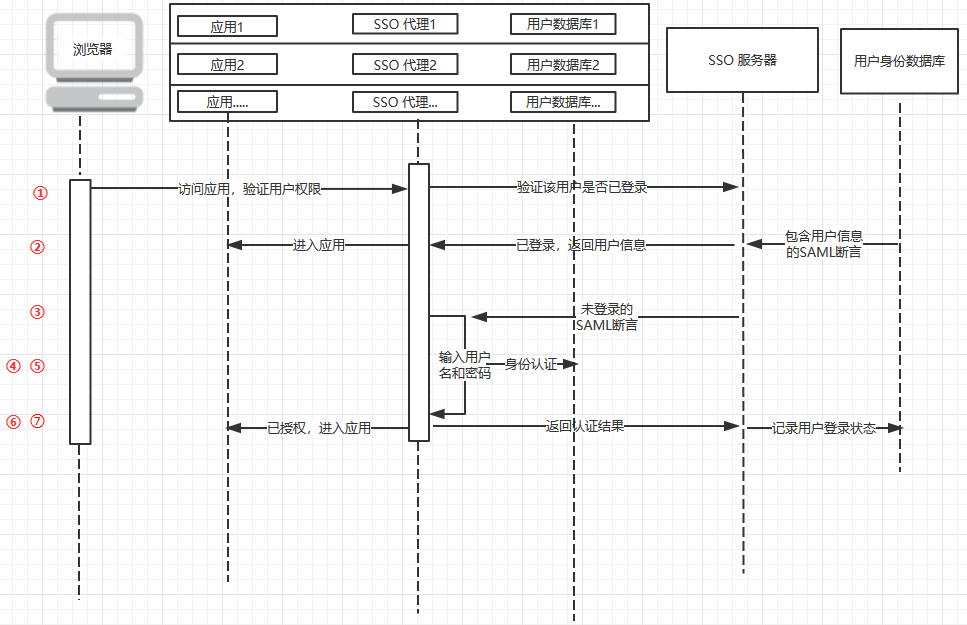

## 重要概念
单点登录（Single Sign On）：简称SSO，在多个应用系统中，用户只需要登录一次就可以访问所有相互信任的应用系统。

活动目录（Active Directory）：面向Windows Standard Server、Windows Enterprise Server以及 Windows Datacenter Server的目录服务。存储了有关网络对象的信息，并且让管理员和用户能够轻松地查找和使用这些信息。Active Directory使用了一种结构化的数据存储方式，并以此作为基础对目录信息进行合乎逻辑的分层组织。

Active Directory 联合身份验证服务（ADFS）：一种用户身份的验证方式，通过把用户身份的验证过程与被该用户访问的服务提供商（SP，Service Provider）进行逻辑分离，在保证用户身份信息被隔离在用户所属系统的内部的同时，为受信任的服务提供方提供所需要的用户信息。

SAML断言（Security Assertion Markup Language）：包含用户身份信息的断言。

服务提供方（Service Provider）：简称SP，提供服务的一方。不负责审核用户的身份信息，依赖于1个或者多个Identity Provider来完成此任务。

身份提供方（Identity Provider）：用于提供对用户的身份信息的正确断言，类似一个公证机构。即身份认证中心。

## 系统架构图

* 用户注册系统：提供用户网上注册。
* 用户授权管理系用系统：主要由应用系统的系统管人员使用。提供组织机构管理、用户管理、应用系统管理、应用系统权限(功能)配置管理、角色管理、角色权限分配、用户权限(角色)分配、用户登录管理功能等功能。
* 认证服务：提供应用系统身份认证接口、权限认证接口、数据访问接口。应用系统通过调用接口实现用户身份认证、权限认证、读取如用户信息及组织机构信息等数据。
* 活动目录（Active Directory）服务：负责存储统一用户及权限管理的数据。
* SSO代理：向SSO服务器查询用户登录状态，操作用户数据库。

## 核心功能实现技术
* Spring：实现依赖管理和以AOP的思想实现事务管理。
* Spring MVC：实现MVC模式。
* Spring LDAP：实现对AD的增删改查操作。
* Spring HATEOAS：实现认证服务的REST FUL风格API。
* Spring Security：保证系统的安全性。
* Spring Security SAML：实现将系统设置成服务提供方。
* AD FS：提供对用户的身份信息的正确断言。
* AD：存储用户信息。

## 流程图

① 用户第一次访问某个应用，SSO代理询问SSO服务器，验证用户是否登录。
② 已登录，SSO服务返回用户信息的SAML断言。用户进入应用。
③ 未登录，跳转到登录页面。
④ 用户输入用户名和密码。
⑤ SSO查询用户数据库进行身份认证。
⑥ 认证成功，返回认证结果给SSO服务器。SSO服务器保存用户登录状态。
⑦ 用户登录成功进入应用。

